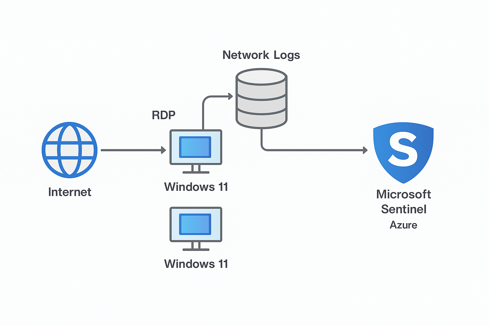
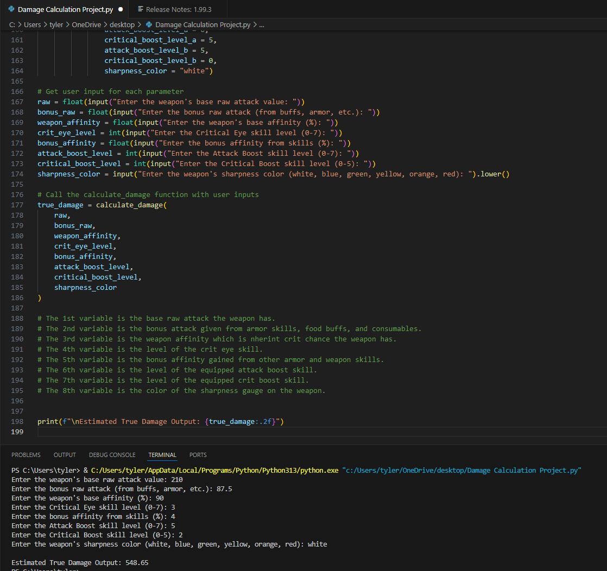

Tyler Ebra|Cybersecurity & Business Student|Hardware & Software Technician|Shift Manager

Welcome to my cybersecurity portfolio. I am currenly pursuing a Bachelor of Business Administration in cybersecurity and I am passionate about SOC analysis, security automation and threat detection. Below is a list of all relevent projects in my cybersecurity journey.

## Education and Certifications

*   B.A. in Cybersecurity, Southeastern University (Expected 12/2025)
*   Comptia Security+ (Expected in 6/2025)
*   Google Cybersecurity Certificate 05/2025


## Relevent Experience

Geek Squad Agent 12/2022 - 06/2024 - Hands on experience troubleshooting and repairing hardware and software issues as well as strenghtening fundamental security practices. 

* * *

# Cybersecurity Projects

## Set up a Home Lab SIEM Monitoring Project
I was able to set up a home lab enviroment where i could test different system nd network vulnerabilities. I was a also able to use the home lab to set up an and peoperly configured a SIEM to monitor the network. It was configured properly to avoid false false positves and detect malicious network traffic.
- Platform: Microsoft Azure
- SIEM Tool: Microsoft Sentinel
- Use: Open RDP Port Honeypot



### Virtual Machines

| VM Name           | OS         | Purpose                   |
|-------------------|------------|---------------------------|
| `TestVM-1`        | Windows 11 | RDP exposed for attack    |
| `TestVM-2`        | Windows 11 | RDP exposed for attack    |
| `LogAnalysis-VM`  | Windows 11 | Log collector + SIEM setup|

### Network Configuration
- Virtual Network: All 3 VMs on same subnet
- RDP Ports Open: 3389 on both Windows VMs (no firewall rules)
- Data Flow: Logs → Log Analytics Workspace → Microsoft Sentinel

### SIEM Configuration and Data Ingestion
- Installed Log Analytics Agent on each Windows VM
- Connected agents to a Log Analytics Workspace**
- Enabled SecurityEvent and Sysmon log collection
  
### KQL Detection Rules in Place

#### Succesful Login Attempts Detection
```kusto
SecurityEvent
| where Activity contains "success" and Account !contains "systems"
```

#### Brute Force Detection
```kusto
SecurityEvent
| where EventID == 4625
| summarize FailedAttempts = count() by Account, bin(TimeGenerated, 5m)
| where FailedAttempts > 5
```

#### PowerShell Usage Detection
```kusto
SecurityEvent
| where EventID == 4104
| where CommandLine contains "Invoke" or CommandLine contains "DownloadString"
```

#### Proccess Creation Detection
```kusto
SecurityEvent
| where EventID == 4688
| where NewProcessName has_any ("cmd.exe", "powershell.exe", "wscript.exe")
```

#### Lateral Movement Detection
```kusto
SecurityEvent
| where EventID in (4688)
| where NewProcessName has_any ("psexec", "wmic", "winrm")
```

#### DNS Exfiltration Detection
```kusto
SecurityEvents
| summarize QueryCount = count() by ClientIP, bin(TimeGenerated, 5m)
| where QueryCount > 100
```

### Project Breakdown
- Opened RDP ports to the internet
- Logged the activity that came through from the internet recording failed and succesful login attempts
- Understood proper SIEM tuning as an abundance of alerts makes it difficult to analyze the logs
- Used KQL rules to filter the logs and produce alerts on important security events

This project helped give me some real-world exposure to setting up and configuring a cloud-based SIEM from scratch, analyzing threats, and writing custom detections rules. This project helped me expand my threat detection and analysis skills as well understanding log fowarding and the importance of properly setting up a SIEM.


## Capture The Flag Completions
> Here are the various CTF challenges I have completed helping me gain a better understanding of ethical hacking and vulnerability assesment.

### Pico CTF
> Below is a link to all the 40+ Pico CTF completions.
>

[Link to CTF's](https://play.picoctf.org/users/RaptorZ)

### Try2Hack.Me
> Completed Try2Hack me CTF challenge completion.
>

[Try2Hack.Me Completions](https://try2hack.me/vysledky)


## Simulated Risk Assesment
> I have completed multiple risk assesments and made incident reports documenting what happened and whare the next actionsble steps. This is a colection of my incident reporting and knowledge.

### Incident Report for Brute Force Attack
> Documentation for an attack on an E-comemrce company and the next steps to take. I analyzed a real-world attack scenario involving DNS and HTTP protocols. The attack was initiated through a brute-force compromise of a website's admin credentials, enabling the attacker to inject malicious redirects onto the website. This led to malware infections on users’ devices. Using Wireshark, I captured and analyzed network traffic to identify the exploitation method and track DNS requests leading to the malicious domain. This project reinforced my understanding of network forensics and intrusion detection while demonstrating my ability to investigate and mitigate cyber threats effectively.
>

[Download The Document](https://github.com/Raptorz84/raptorz.github.io/blob/15bdc9623fd10e93b18135d6bb792b66d24f423d/Incident%20Report%20for%20E-Commerce%20Company.pdf)

### Incident Handler's Journal 
> In this project, I documented and analyzed multiple cybersecurity incidents, including ransomware attacks, phishing attacks, and malware infections. Using structured analysis such as the 5 W’s of incident analysis, I detailed each attack’s execution and impact as well as the possible mitigation strategies. Tools like Wireshark and VirusTotal were used to investigate malicious files and network activity. This project strengthened my ability to perform threat analysis, and incident response reporting, showcasing my skills in identifying, documenting, and mitigating cyber threats.
>

[Download The Document](https://github.com/Raptorz84/raptorz.github.io/blob/15bdc9623fd10e93b18135d6bb792b66d24f423d/Incident%20Handler's%20Journal%20.pdf)

### Incident Report for SYN Flood Attack
> In this project, I investigated a SYN flood attack that disrupted a company’s DNS services. Using Wireshark, I analyzed network traffic and identified an excessive number of SYN requests overwhelming port 53, preventing legitimate users from accessing the website. Through packet capture analysis, I confirmed the characteristics of a DoS attack, demonstrating my ability to detect and analyze network-based threats. This hands-on experience strengthened my skills in intrusion detection and threat analysis, preparing me for real-world cybersecurity incident response scenarios.
>

[Download The Document](https://github.com/Raptorz84/raptorz.github.io/blob/15bdc9623fd10e93b18135d6bb792b66d24f423d/Incident%20Report%20for%20SYN%20Flood%20Attack.pdf)

# Coding Projects
> This is a list of all the coding relating projects I have completed with relevent code attached.

## Python

### IP Allow List
This script automates the process of maintaining an IP allow list, ensuring that only authorized employees can access a restricted subnetwork. The algorithm scans the allow list, checks for any IPs that appear on a remove list, and updates the file accordingly.

```python
# Defined a function named `update_file` that takes in two parameters: `import_file` and `remove_list`
def update_file(import_file, remove_list):

    # Used a 'with` statement to read in the initial contents of the file
    with open(import_file, "r") as file:

    # Used `.read()` to read the imported file and store it in a variable named `ip_addresses`
    ip_addresses = file.read()

    # Used `.split()` to convert `ip_addresses` to a list from a string
    ip_addresses = ip_addresses.split()

    # Built an iterative statement that loops through 'ip_addresses' using the variable 'element'
    for element in ip_addresses:

    # Built a conditional statement that checks if the current 'element' is in the 'remove_list'
    # and removes it
       if element in remove_list:
         ip_addresses.remove(element)

    # This converts the `ip_addresses` back to a string so that it can be written into the text file 
    ip_addresses = " ".join(ip_addresses)       

    # Used a `with` statement to rewrite the original file by replacing its content with 'ip_addresses'
    with open(import_file, "w") as file:
      file.write(ip_addresses)

# Calls `update_file()` function and passes in "allow_list.txt" and the list of IP addresses to be removed
update_file("allow_list.txt",["192.168.25.60", "192.168.140.81", "192.168.203.198"] )

# Used a 'with' statement to read the updated file and store its contents the 'text'
with open("allow_list.txt", "r") as file:
  text = file.read()

# Display the contents of 'text'
print(text)
```
The script uses a funtion that intakes the list of ip addresses as well as the ip addresses that should be removed. It also updates the existing list of ip addresses after the removal. After the function is executed the updated file list is printed.

### Monster Hunter Damage Calculator

A Python tool that models real in-game damage using modular logic and skill-based multipliers. This project helps simplify the calculation of true raw effective damage in Monster Hunter Wilds. It is used to compare various skills to find out what combination is deals the optimal amount of damage.




[Link To Code](https://github.com/Raptorz84/raptorz.github.io/blob/main/Damage%20Calculation%20Project.py)

***

# Link to additional resources

### LinkedIn

[Link](https://www.linkedin.com/in/tyler-ebra-068662320/)

### Resume

[View Document](https://github.com/Raptorz84/raptorz.github.io/blob/fbd6c5710cb68a23d32e9d0af3e2733e8b2b8096/Tyler's%20Resume.pdf)
